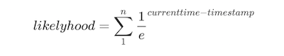
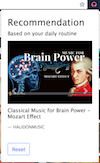

#  chrome-extension-youtube-controller

This extension is designed to for users to listen to Youtube music while doing other things, and recommend ing fresh videos based on user's behavior at different times. Ads can also be blocked by this app.

### Project Outline

Inspired by my wife, I developed this chrome extension for her to listen to music on Youtube during studying. For there is no way to switch to the next song or previous song by not returning to Youtube's tab, this extension provide basic global keyboard short cut to control Youtube, which means you can switch songs, pause and like a video anywhere even if Chrome is not focused. When video is switched, notification of the new video will show on the top of the screen.

**Global keyboard shortcut**

| Functions             | Shortcuts for Mac   | Shortcuts for Windows |
| --------------------- | ------------------- | --------------------- |
| Back to previous song | Shift + Command + 1 | Shift + Ctrl + 1      |
| Go to next song       | Shift + Command + 2 | Shift + Ctrl + 2      |
| Pause video           | Shift + Command + 7 | Shift + Ctrl + 7      |
| Like video            | Shift + Command + 9 | Shift + Ctrl + 9      |

Apart from this basic functionality, I myself added video recommendation and ads block functions to the extension. 

**Hourly video recommendation**

People have routines, sometime we like to listen to or watch a specific style or type of video at a certain time. So this function is designed to meet this need to recommend videos to users according to the current time user is watching the videos, based on the history behavior of the user.

To implement video recommendation, I collect all the **tags** of every video to which user shows interest (watch full length, like the video or subscribe the channel etc.), by querying Youtube V3 API. And store the tags each with a current timestamp into a list in localstorage. After that, I designed an algorithm to calculate the top 5 videos user most likely to watch at the time videos. 



The larger time difference between current time and timestamp of a tag the less likely user want to watch this type of video now. And the more times a video is watched, the more preferable it is. Code below shows how I implement the main video recommendation algorithm. This function receive the user favorite video's tags with timestamps and return top 5 most interesting videos.

```javascript
function recAlgorithm(favTags) {
    let curHour = new Date().getHours();
    let map = [];
    for (let item in favTags) {
        let sum = 0;
        favTags[item].forEach(function (ele) {
            sum += Math.pow(1 / Math.E, (ele - curHour));
        });
        map.push([item, sum]);
    }
    return map.sort((a, b) => b[1] - a[1]).slice(0, 5).map(ele => ele[0]);
}
```

**Ads block** (In progress)

Now ads block function can only skip the video ads when it appears. Currently I am working on using regex filter to block more ads.

### Problems met during this project:

+ Notifications
  + If id is static, new notification will not shown but be updated.
+ All chrome api are async. 
+ Youtube use AJAX to load contents when switching videos, while all other components on the page will not be updated. So listener should not be added twice when url changes.
+ In order to optimize the performance, some DOM elements may be appended later. To deal with this problem, my way is to use `setTimeOut` function to query some elements but not depend on `window.onload`.
+ `window.location.href = message.url` will reload the whole page (need to add all listeners again) while `nextPageButton.click()` will only load the contents because Youtube use AJAX
+ Requirement for keyboard shortcuts is very strict in Chrome especially global ones. Be careful not to conflict with system or other app's shortcut.

### Conclusion

Learned a lot from developing this project. After a long debugging journey, the extension works perfectly fine with no bugs. Installed on my wife's laptop, I finished my job hooray! In the future, I will keep modifying this project (move on to ES6) and add more ads filters.



Thanks for reading this! Your star means a lot to me. Hope you have a good day!
